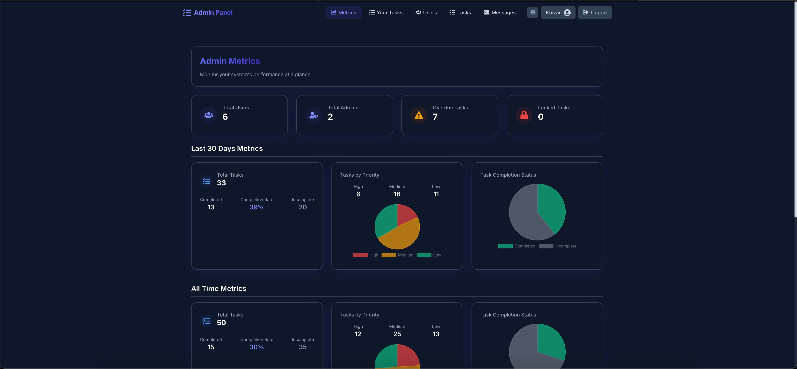
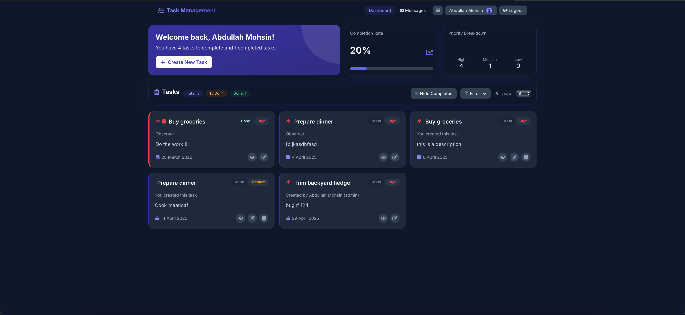
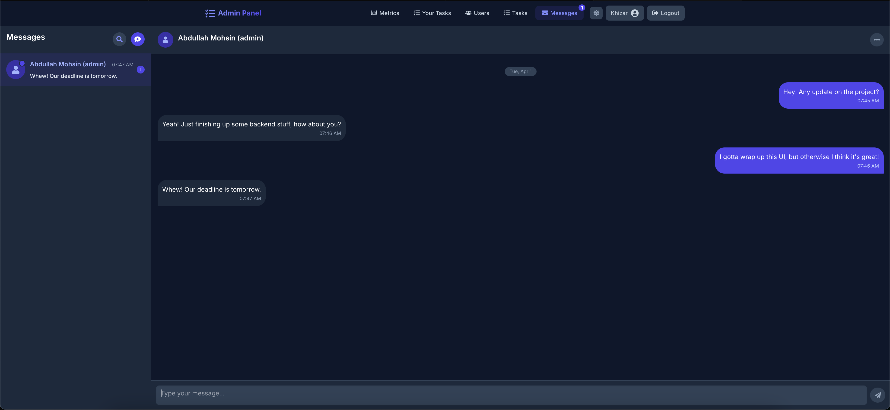

# TSKFLO

## Overview

A comprehensive task management system designed for team collaboration, with role-based access control, task tracking, and real-time communication features. The system provides a secure and efficient way for teams to organize, assign, and monitor tasks.

## Screenshots

Below are screenshots showcasing key features of TSKFLO:

### Homepage


### Admin Dashboard


### Task Dashboard


### Messaging Interface


## Features

### User Authentication and Role-Based Access Control

- Secure login and logout functionality with JWT-based authentication
- Role-based access control with admin and user roles
- Admin user management (create, update, delete users)
- Admin ability to lock tasks to prevent further changes

### Task Management

- Comprehensive task creation and management
- Tasks include title, description, priority, due date, status, and assignee(s)
- Multiple assignees per task
- Task search functionality with multiple criteria
- Task notifications for team members

### Team Communication

- Live messaging functionality for team collaboration
- Real-time notifications for task assignments and updates

### Admin Dashboard

- Metrics and analytics for task progress tracking
- User management interface
- System-wide task monitoring

## Technologies Used

### Backend

- Node.js with Express.js
- MongoDB with Mongoose
- JWT for authentication
- Socket.io for real-time features
- Winston for logging
- Jest for testing
- Nodemailer for email notifications

### Frontend

- React.js with React Router
- Redux for state management
- Tailwind CSS for styling
- Axios for API requests
- Socket.io-client for real-time features
- React Chartjs-2 for dashboard visualizations

## Implementation Patterns

### Design Patterns

1. **Observer Pattern**: Implemented in the notification system and socket connections to provide real-time updates.
2. **Factory Pattern**: Used for standardized object creation in tasks, users, and API requests.

### Architectural Pattern

- **Layered Architecture**: Clear separation between presentation (frontend), business logic (controllers), and data access (models) layers.

## Installation and Setup

### Prerequisites

- Node.js (v16+)
- MongoDB (v4+)
- npm or yarn
- Docker and Docker Compose (optional, for containerized setup)

### Backend Setup

```bash
# Navigate to backend directory
cd backend

# Install dependencies
npm install

# Set up environment variables
# Create a .env file with the following variables:
# PORT=5000
# MONGO_URI=your_mongodb_connection_string
# ACCESS_TOKEN_SECRET=your_access_token_secret
# REFRESH_TOKEN_SECRET=your_refresh_token_secret
# EMAIL_USER=your_email_for_notifications
# EMAIL_PASS=your_email_password

# Start the development server
npm run dev
```

### Frontend Setup

```bash
# Navigate to frontend directory
cd frontend

# Install dependencies
npm install

# Start the development server
npm run dev
```

### Docker Setup (Alternative)

The application can also be run using Docker Compose:

```bash
# Start all services
docker-compose up -d

# Stop all services
docker-compose down
```

## API Documentation

TSKFLO provides a comprehensive REST API with the following key features:

- JWT-based authentication
- User management endpoints
- Task CRUD operations
- Team communication endpoints
- Admin management interfaces

For detailed API documentation including all endpoints, request/response formats, and authentication requirements, refer to the `deliverables' folder.

## Usage

### Admin Functions

- Manage users (create, update, delete)
- Assign tasks to team members
- Lock tasks to prevent further changes
- View dashboard metrics and analytics
- Search tasks by various criteria

### Team Member Functions

- Create, update, and view tasks
- Assign tasks to other team members
- Search tasks using multiple criteria
- Receive notifications for task assignments
- Communicate with team members via messaging

## Project Structure

```
tskflo/
├── backend/
│   ├── controllers/    # Business logic
│   ├── models/         # Database schemas
│   ├── middleware/     # Authentication and error handling
│   ├── endpoints/      # API routes
│   ├── utils/          # Helper functions
│   ├── logs/           # Application logs
│   └── __tests__/      # Backend tests
│
├── frontend/
│   ├── src/
│   │   ├── components/ # Reusable UI components
│   │   ├── pages/      # Main application screens
│   │   ├── features/   # Redux slices and features
│   │   ├── context/    # React contexts
│   │   ├── services/   # API service functions
│   │   ├── utils/      # Helper functions
│   │   ├── app/        # Redux store and app configuration
│   │   ├── assets/     # Static assets
│   │   └── routes/     # Application routing
│
├── deliverables/       # Project documentation and deliverables
├── Test_Results/       # Test results and documentation
│   ├── coverageResults/# Test coverage reports
│   └── testing-documentation.md # Testing methodology
├── docker-compose.yml  # Docker Compose configuration
└── Dockerfile          # Docker configuration
```

## Test Results

The application has been thoroughly tested with comprehensive unit tests. The test coverage report is available in the [Test_Results/coverageResults](Test_Results/coverageResults) directory. For additional testing information and methodology please refer to our [testing documentation](Test_Results/testing-documentation.md).

## Deliverables

Project documentation and deliverables are available in the `deliverables/` directory, including:
- API documentation
- User manuals
- Technical specifications
- Architecture diagrams

## License

This project is licensed under the MIT License.
